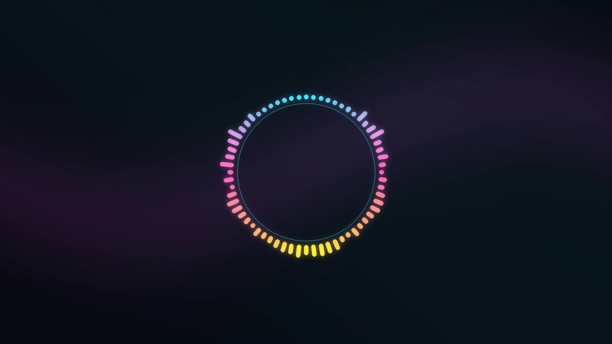

# MangaNarrator Video Backend

FastAPI and FFmpeg video rendering for MangaNarrator. The existing OCR, segment, image and chapter endpoints remain available. Audio Studio adds an independent audio-to-video workflow.

## Audio Studio: Start Here

Activate your backend environment from this repository:

```powershell
conda activate manganarrator-video
pip install -r requirements.txt
pip install -r requirements-audio.txt
uvicorn video_server:app --host 127.0.0.1 --port 8084
```

Open **http://127.0.0.1:8084/studio/**. No frontend build or npm installation is required. Use one backend worker; audio renders queue within that process.

The environment also needs `mn_contracts` from the existing MangaNarrator setup, NumPy and OpenCV (the latter is already in requirements). FFmpeg and FFprobe must be on PATH. The original environment setup and `config.yaml` still apply.

1. Choose your MP3 or WAV under **Audio file**. The original recording can be played in the audio player.
2. Select an animated abstract background, or switch to **Video clips** and upload one or more clips.
3. Configure a circular, horizontal or vertical spectrum. Add up to four independently configured layers.
4. Click **Preview 5 seconds**. This renders the first five seconds through the same spectrum renderer as the final export, at up to 960x540. Geometry scales with the preview; final output uses the selected resolution.
5. Watch progress under **Render jobs**. When complete, the preview loads into the video player; press Play.
6. Adjust settings and preview again. Click **Render video** when satisfied.
7. Use **View** or **Download** beside a completed job. Job history survives page refreshes. **Check status** also accepts a job ID from a curl/API request.

Changing settings does not redraw an existing video. Generate another preview to see the new settings. The initial still is a sample, not a visualization of your newly selected recording.



## What Changed In The Visualizer

Circular output is now a radial frequency spectrum with separate rounded bars around a ring. It replaces the previous stereo vectorscope. Horizontal and vertical modes use the same measured frequency bands.

A 4096-sample Hann window feeds NumPy's FFT at each video timestamp. Stereo power is averaged across channels, avoiding cancellation in opposite-phase recordings. Logarithmically spaced frequency bands drive each bar. Fast attack preserves transients; adjustable release smooths the motion. OpenCV draws the colored spectrum and glow. No prerecorded visualizer overlay is used.

## Settings

| Setting | Meaning |
| --- | --- |
| Resolution / FPS | Default 2560x1440 at 30 FPS. UI includes 720p, 1080p, 1440p, 4K and vertical 1080p. JSON accepts even dimensions from 128 to 3840, FPS 1-60. |
| Encoder | NVIDIA H.264 NVENC or CPU H.264. The UI probes actual NVENC initialization and selects CPU when unavailable. |
| Quality | Draft CQ/CRF 28, balanced 23, high quality 18. Lower values generally produce larger files. |
| Layout / shape | Circular, horizontal or vertical; bars, connected lines or dots. |
| Position / size | Nine anchor positions, width/height, and X/Y edge margins in output pixels. Oversized overlays are fitted to the frame. |
| Bars | `frequency_bins`, 8-256 via JSON. This is the actual bar count. |
| Sensitivity | `gain`, 0.1-10. Increase for quieter recordings. |
| Response scale | `log` (default), `lin`, `sqrt`, `cbrt`. Log exposes quieter frequency bands. |
| Radius | `radius`, 0.05-0.4 of the circular layer's shorter dimension. |
| Thickness | `bar_width`, 0.1-0.95 of the space per bar. |
| Glow | `glow`, 0-2. Zero disables the glow. |
| Smoothing | `smoothing`, 0-0.98. Higher values give a slower release; zero follows each frame directly. |
| Colors | One hex color or a palette separated by `|`, e.g. `#22d3ee|#ec4899|#facc15`. Colors interpolate across the bands. |
| Opacity | `opacity`, 0-1. `background_opacity` darkens the rectangle behind a layer; zero leaves it transparent. |
| Frequency range | JSON: `min_frequency` (20-1000 Hz), `max_frequency` (1001-20000 Hz). Defaults 40-16000 Hz. |
| Background | `generated_style`: aurora, nebula, gradient or plasma; `color_a/b/c` and `blur` configure the animated color field. |
| Clip speed | `background.playback_rate`, 0.05-8. Clips are normalized, played in order, looped and trimmed to the audio. Their sound is discarded. |
| Audio bitrate | JSON: `render_config.audio_bitrate`, e.g. `192k` or `320k`. Output is AAC in an H.264/yuv420p MP4. |

**Configuration JSON** can import, edit and export the complete request settings. `audio_ref` is supplied automatically by the upload. Saved configuration files are portable between curl, the studio and the JSON API.

## GPU And Performance

The studio defaults to NVENC preset `p1` for fast encoding, with `tune: hq`. GPU capability detection actually encodes a short test frame sequence. A requested GPU export reports an error if NVENC subsequently fails; it does not silently change encoders.

FFT analysis and OpenCV drawing run on the CPU. NVENC handles final video encoding. Generated backgrounds are computed at low resolution and enlarged, avoiding the old full-resolution FFmpeg expression filter cost. More layers, glow, 4K and 60 FPS increase rendering work. Preview first, then export at the target resolution. CPU mode uses libx264's veryfast preset and the configured CRF quality.

## Files And Job Status

`media_root` comes from `config.yaml`. With the current local configuration:

- Uploads: `E:/pcc_shared/manga_narrator_runs/outputs/audio_video_uploads/`
- Videos: `E:/pcc_shared/manga_narrator_runs/outputs/audio_video/{run_id}/{output_name}`
- Job database: `jobs/jobs.db`, ignored by Git.

Each upload gets a unique run directory, even when you supply a run ID prefix. The completed job's `result.data` is the authoritative MediaRef. Preview videos are named `preview.mp4`; they are separate jobs from full exports. Intermediate PCM and normalized background files are removed after rendering. Uploaded source files and completed videos remain until you remove them.

Progress is persisted with the processing stage. It reaches 100 only after the MP4 is finalized. The frontend polls every two seconds. Decode and background preparation show a stage; frame rendering shows percentage progress. Job errors are visible in the UI. After a backend restart, unfinished audio jobs are marked interrupted and must be submitted again.

## API

| Method / endpoint | Purpose |
| --- | --- |
| `POST /video/build/audio_upload` | Multipart `audio_file` and optional `config_json`; returns a job ID. |
| `POST /video/build/audio` | JSON request with an existing `audio_ref`. |
| `GET /video/status/{job_id}` | Status, result, error, progress and stage. |
| `GET /video/audio/jobs` | Latest 30 audio jobs. Older jobs remain accessible by ID. |
| `GET /video/audio/jobs/{job_id}/file` | Stream a completed MP4. Add `?download=true` to download. |
| `POST /video/audio/background` | Multipart `video_file`; returns a MediaRef for `background.media_refs`. |
| `GET /video/audio/capabilities` | Probe NVENC availability. |
| `GET /studio/` | Portable frontend. |
| `GET /docs` | Interactive FastAPI API documentation. |

Audio uploads support MP3, WAV, FLAC, M4A, OGG and AAC, subject to installed FFmpeg decoders. Background uploads support MP4, MOV, MKV and WebM. Each upload is limited to 512 MB. Invalid JSON/settings and files without the requested stream produce HTTP 422 before a job is started.

From your test-file directory, this works in PowerShell or Git Bash:

```powershell
curl.exe -X POST "http://127.0.0.1:8084/video/build/audio_upload" -F "audio_file=@new_divide_1.mp3" -F "config_json=<audio_video_config.json"
```

Use a plain URL. The `@` uploads the audio file; `<` reads the JSON file. Do not escape underscores in field names.

A minimal JSON request for an existing uploaded audio file:

```json
{
  "audio_ref": {"namespace": "outputs", "path": "audio_video_uploads/recording.wav"},
  "output_name": "recording.mp4",
  "render_config": {
    "viewport_w": 2560, "viewport_h": 1440, "fps": 30,
    "vcodec": "h264_nvenc", "preset": "p1", "tune": "hq", "cq": 23
  },
  "visualizers": [{
    "kind": "circular", "position": "center", "width": 850, "height": 850,
    "frequency_bins": 64, "scale": "log",
    "colors": "#22d3ee|#ec4899|#facc15"
  }]
}
```

## Portable Frontend

Everything in `frontend/` is independent of the Python source and uses relative asset URLs. It has no build step, runtime CDN or framework dependency. Copy that directory into another frontend, import `studio.js`, and mount `<audio-video-studio api-base="http://127.0.0.1:8084">`. Styles are isolated in a Shadow DOM. The API client can also be imported separately into React, Vue or another framework.

See [frontend integration guide](frontend/README.md) for standalone serving, component events and publishing updates.

## Verification

```powershell
python -m unittest discover -s tests -v
```

Tests cover FFT frequency response, opposite-phase stereo, silence/release, all layouts and shapes, validation, MP3/WAV output and duration. Run the studio's five-second preview with a real recording to judge the visual response before exporting.

The original MangaNarrator endpoints remain: `/video/preview/ocrrun`, `/video/preview/load`, `/video/preview/save`, `/video/build/ocrrun`, `/video/build/from_preview`, `/video/build/image` and `/video/build/segment`.
